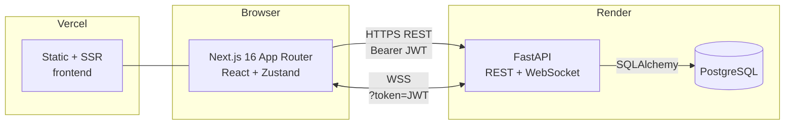
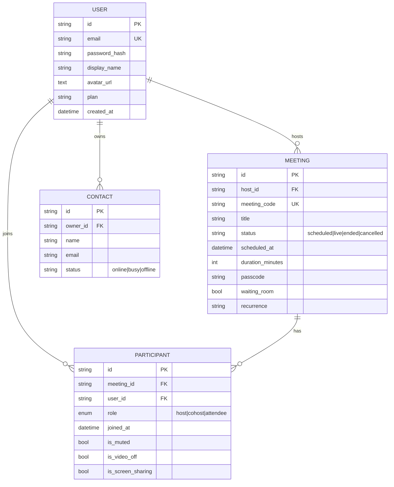
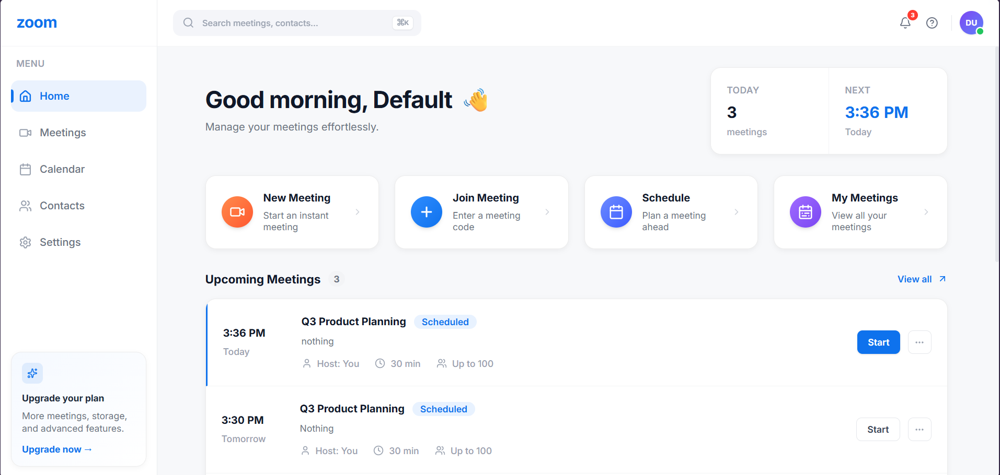
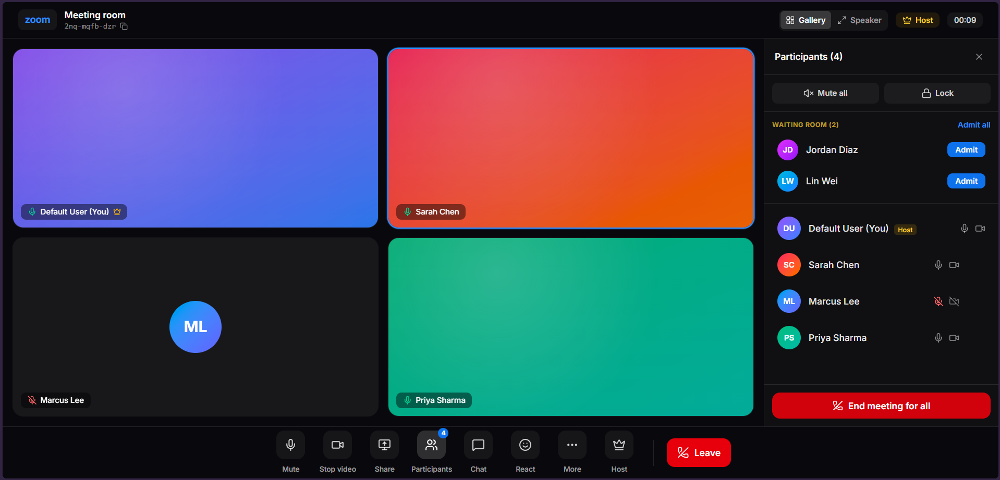
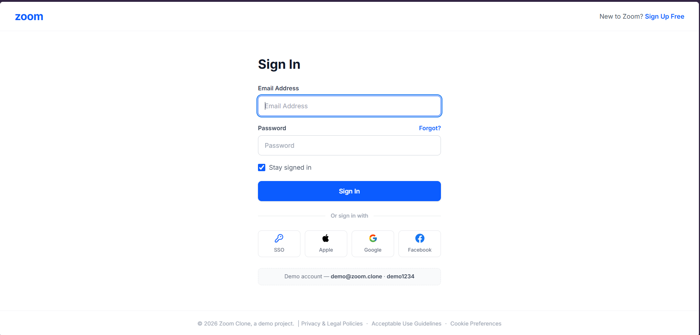
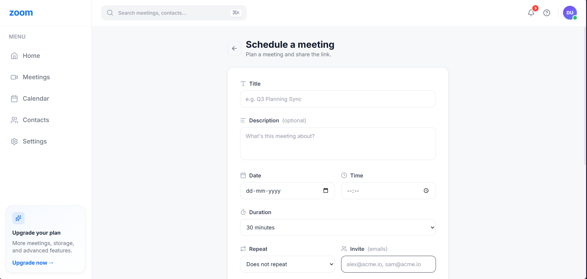
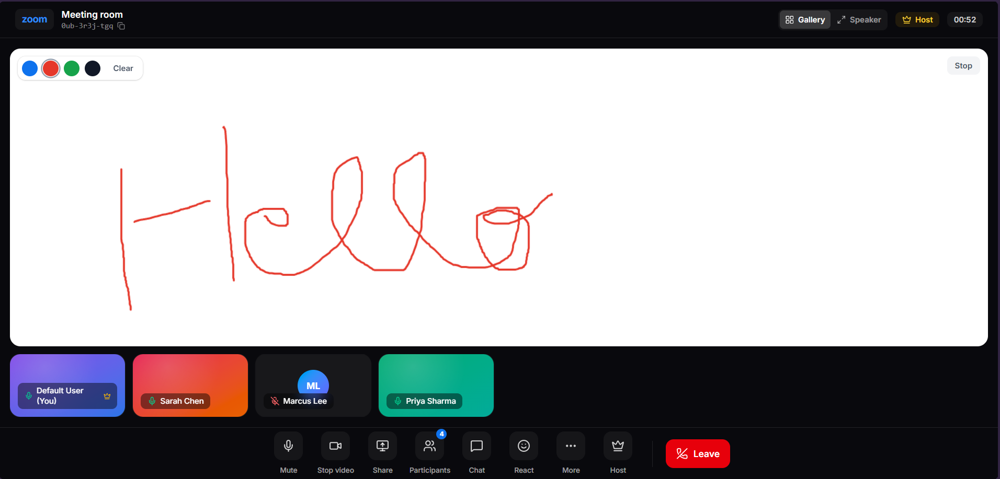

<div align="center">

# 🎥 Zoom Clone

A full-stack video-conferencing web app inspired by **Zoom Workplace** — real authentication, scheduling, a polished meeting room, and **live collaboration over WebSockets** (presence, chat, whiteboard, breakout rooms, host controls).

[](https://nextjs.org/)
[](https://fastapi.tiangolo.com/)
[](https://www.postgresql.org/)
[](#deployment-guide)

**Live demo:** [zoomclone-sooty.vercel.app](https://zoomclone-sooty.vercel.app) · **API:** [zoom-clone-api-9j7o.onrender.com](https://zoom-clone-api-9j7o.onrender.com/health)
**Demo login:** `demo@zoom.clone` / `demo1234`

</div>

> [!NOTE]
> Video/audio are **not** carried over WebRTC — meeting tiles are presentation placeholders. Everything else (auth, scheduling, live presence/chat/whiteboard/breakout, host controls, real screen capture) is fully functional. See [Known Limitations](#known-limitations).

---

## Table of Contents
1. [Project Overview](#project-overview)
2. [Architecture](#architecture)
3. [Folder Structure](#folder-structure)
4. [Database Design](#database-design)
5. [API Documentation](#api-documentation)
6. [Setup Instructions](#setup-instructions)
7. [Deployment Guide](#deployment-guide)
8. [Screenshots](#screenshots)
9. [Future Improvements](#future-improvements)
10. [Known Limitations](#known-limitations)

---

## Project Overview

Zoom Clone is a production-deployed clone of the Zoom web experience built to demonstrate a complete, modern full-stack architecture.

### Features
- **Authentication** — email/password signup & login, JWT sessions, every page behind an auth guard, logout.
- **Meetings** — start instant meetings, join by code/link, and schedule future meetings (passcode, waiting room, recurrence, invitees, default media, join-before-host).
- **Meeting room** — gallery/speaker layouts, reactions, raise hand, polls, captions toggle, host controls (mute all, **lock**, remove, promote, end), and **real screen sharing** via `getDisplayMedia()`.
- **Real-time over WebSockets** — live **presence**, **chat**, a collaborative **whiteboard**, **breakout rooms**, **host permissions** (allow/disable participant share·chat·rename), and self-rename — all server-enforced.
- **Directory & productivity** — contacts (real backend + live presence), calendar, a ⌘K command-palette search, profile editing with avatar upload, a notifications panel, and a mock plans/billing page.

### Tech Stack
| Layer | Technology |
|---|---|
| Frontend | Next.js 16 (App Router), React 19, TypeScript, Tailwind CSS v4, Zustand, lucide-react |
| Backend | FastAPI, SQLAlchemy 2.0, Pydantic v2, `websockets` (via Uvicorn) |
| Auth | PBKDF2-HMAC-SHA256 hashing + HS256 JWT (Python **stdlib only**, no external auth deps) |
| Database | SQLite (dev) · PostgreSQL (prod) |
| Hosting | Vercel (frontend) · Render (API + managed Postgres) |

---

## Architecture



**Request flow**
- **REST** — the frontend's `apiClient` attaches `Authorization: Bearer <token>` (from `localStorage`) to every call; a `401` clears the token and redirects to `/login`.
- **WebSocket** — the room opens `wss://…/api/v1/ws/meetings/{code}?token=…`; the server authenticates the token, then a `RoomManager` owns domain state (presence, chat, board, breakout, permissions, lock) and a `ConnectionManager` handles delivery (unicast/broadcast).
- **Layered backend** — routes → repositories → models, with Pydantic schemas at the edges and business logic kept out of route handlers.

---

## Folder Structure

```
Zoom Clone/
├── backend/
│   ├── app/
│   │   ├── api/
│   │   │   ├── deps.py              # Auth dependency (Bearer → User), DB session
│   │   │   └── v1/
│   │   │       ├── auth.py          # register / login / me
│   │   │       ├── users.py         # me / update profile
│   │   │       ├── meetings.py      # instant / join / schedule CRUD
│   │   │       ├── contacts.py      # directory CRUD (+ live presence)
│   │   │       ├── ws.py            # WebSocket endpoint
│   │   │       └── router.py        # aggregates v1 routers
│   │   ├── core/                    # config, security (JWT/hash), exceptions, logging
│   │   ├── db/                      # base, session, init_db, seed
│   │   ├── models/                  # user, meeting, participant, contact, enums
│   │   ├── repositories/            # base + user/meeting/contact repos
│   │   ├── schemas/                 # Pydantic request/response models
│   │   ├── websocket/              # events, connection, manager, room_manager, handlers, presence
│   │   └── main.py                  # app factory, CORS, lifespan (create_all + seed)
│   ├── alembic/                     # migrations
│   ├── requirements.txt
│   ├── Procfile · Dockerfile · render.yaml · .python-version
│   └── .env.example
├── frontend/
│   ├── src/
│   │   ├── app/
│   │   │   ├── (app)/               # authed shell: dashboard, meetings, calendar, contacts, settings, billing, schedule
│   │   │   ├── login/ · signup/     # Zoom-style auth pages
│   │   │   ├── room/[meetingCode]/  # the meeting room
│   │   │   └── layout.tsx
│   │   ├── components/              # layout (Navbar/Sidebar/Search), ui, auth, AuthGuard, Providers
│   │   ├── hooks/useMeetingSocket.ts
│   │   ├── lib/                     # api/ (client, auth, users, meetings, contacts), auth, prefs, image, utils, realtime/socket
│   │   ├── store/                   # userStore, roomStore (Zustand)
│   │   └── types/
│   ├── next.config.ts · vercel.json · .env.example
│   └── package.json
├── DEPLOYMENT.md                    # full deploy walkthrough
└── README.md
```

---

## Database Design



**Notes**
- UUID string primary keys (safe to expose in URLs).
- `meetings.status` is a string enum; scheduling options (passcode, waiting room, recurrence, invitees, media defaults) live on the meeting row.
- Datetimes are stored as UTC and serialized as UTC-with-offset ISO strings so the client can render them in the user's local timezone.
- Tables are created on startup (`Base.metadata.create_all`) and seeded idempotently (demo user, sample meetings, contacts). Alembic is included for forward migrations.

---

## API Documentation

Base URL: `/api/v1` · Interactive docs (Swagger) at **`/api/docs`** · Health at **`/health`**.
All endpoints except `auth` require `Authorization: Bearer <token>`.

### Auth — `/auth`
| Method | Path | Description |
|---|---|---|
| `POST` | `/register` | Create account → `{ access_token, user }` (409 if email taken) |
| `POST` | `/login` | Sign in → `{ access_token, user }` (401 on bad credentials) |
| `GET`  | `/me` | Current account |

### Users — `/users`
| Method | Path | Description |
|---|---|---|
| `GET`   | `/me` | Current profile |
| `PATCH` | `/me` | Update `display_name` / `avatar_url` (avatar may be an uploaded data-URL; `null` clears it) |

### Meetings — `/meetings`
| Method | Path | Description |
|---|---|---|
| `GET`    | `/` | List the user's meetings (optional `?status=`) |
| `POST`   | `/instant` | Start a live meeting → meeting + `invite_url` |
| `POST`   | `/join` | Join by code or invite link |
| `POST`   | `/` | Schedule a future meeting |
| `GET`    | `/{id}` | Fetch one meeting |
| `PATCH`  | `/{id}` | Edit a scheduled meeting |
| `DELETE` | `/{id}` | Delete a meeting |

### Contacts — `/contacts`
| Method | Path | Description |
|---|---|---|
| `GET`    | `/` | List contacts (status overlaid with **live** presence) |
| `POST`   | `/` | Add a contact |
| `DELETE` | `/{id}` | Remove a contact |

### WebSocket — `/ws/meetings/{meeting_code}?name=&pid=&token=`
Frame format: `{ "type": <event>, "data": {…} }`.

| Direction | Events |
|---|---|
| Client → Server | `chat` · `draw` · `clear-board` · `breakout` · `breakout-end` · `media-state` · `hand` · `permissions` · `rename` · `lock` · `ping` |
| Server → Client | `room-state` · `participant-joined` · `participant-left` · `participant-renamed` · `host-changed` · `lock-state` · `chat` · `draw` · `media-state` · `hand` · `permissions` · `pong` · `error` |

---

## Setup Instructions

**Prerequisites:** Python 3.10+ (3.12 recommended) and Node.js 18+.

### 1. Backend
```bash
cd backend
python -m venv .venv
# Windows: .venv\Scripts\activate   |   macOS/Linux: source .venv/bin/activate
pip install -r requirements.txt
cp .env.example .env                 # defaults to local SQLite
uvicorn app.main:app --reload --port 8000
```
API → `http://localhost:8000` · Swagger → `http://localhost:8000/api/docs`. The DB is created and seeded automatically on first run.

### 2. Frontend
```bash
cd frontend
npm install
cp .env.example .env.local           # NEXT_PUBLIC_API_URL=http://localhost:8000
npm run dev
```
App → `http://localhost:3000`. Sign in with `demo@zoom.clone` / `demo1234`.

---

## Deployment Guide

Deployed as **Vercel (frontend) + Render (API + Postgres)**. Full step-by-step — including env-var tables and the CORS/URL wiring — is in **[DEPLOYMENT.md](DEPLOYMENT.md)**. In short:

1. **Backend (Render)** — use the included `render.yaml` blueprint (provisions the API + a Postgres DB). Pins **Python 3.12** via `.python-version` (Render's default 3.14 has no wheels for some deps). Set `SECRET_KEY`, then `ALLOWED_ORIGINS` + `FRONTEND_URL` to your Vercel URL.
2. **Frontend (Vercel)** — root directory `frontend`, set `NEXT_PUBLIC_API_URL` to the Render API URL, deploy.

| Service | Key variables |
|---|---|
| Backend | `DATABASE_URL`, `SECRET_KEY`, `ALLOWED_ORIGINS`, `FRONTEND_URL`, `ENVIRONMENT` |
| Frontend | `NEXT_PUBLIC_API_URL` |

---

## Screenshots

| Dashboard | Meeting Room |
|---|---|
|  |  |

| Sign Up | Schedule | Whiteboard |
|---|---|---|
|  |  |  |

---

## Future Improvements
- **Real WebRTC media** — peer audio/video and live screen-pixel relay (SFU) to replace placeholder tiles.
- **Q&A** and **real live captions** (Web Speech API / streaming STT).
- **Cloud recording** with playback + AI meeting summaries.
- **Pin / spotlight** logic and **virtual backgrounds** (segmentation).
- **Real billing** (Stripe) behind the plans page, and **object storage** for avatars/recordings.
- **Persistent team chat**, push **notifications** backend, and OAuth/SSO sign-in.

## Known Limitations
- **No WebRTC** — by design, video/audio tiles are placeholders; real presence/chat/whiteboard are live, but media isn't streamed between peers.
- **Screen share** captures the host's screen locally and broadcasts a "sharing" indicator; the actual pixels aren't relayed to others (needs WebRTC).
- **Billing, captions, recording, notifications** are UI/mock — no payment processor, STT, capture, or notifications backend.
- **Free-tier cold start** — the Render API sleeps after inactivity, so the first request (and WS connect) can take ~50s to wake.
- **Avatars** are stored inline as compact data-URLs in the database (fine at avatar size; not how production would store large uploads).

---

<div align="center">
Built as a full-stack learning project. Not affiliated with Zoom Video Communications, Inc.
</div>
